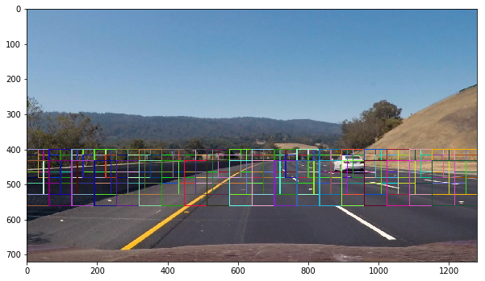
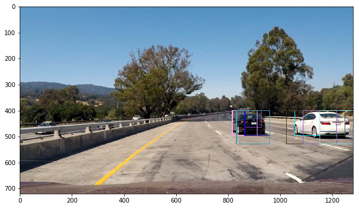
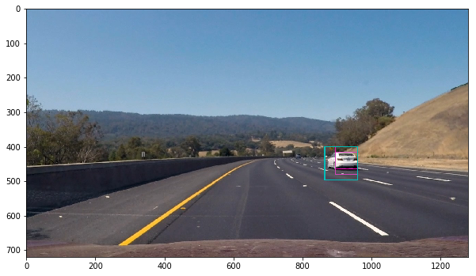
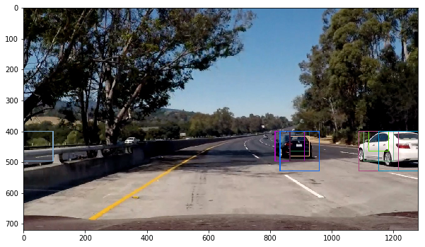
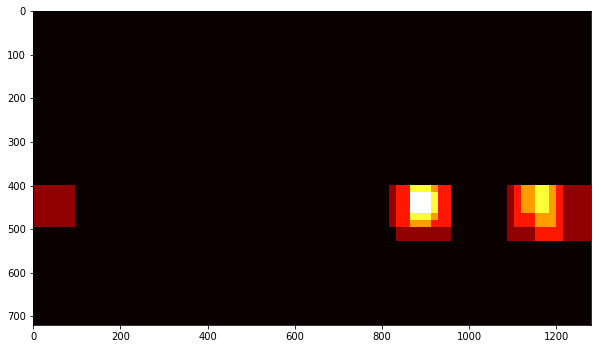
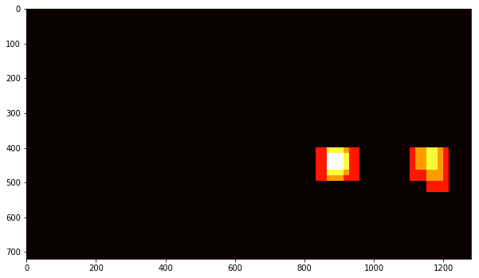
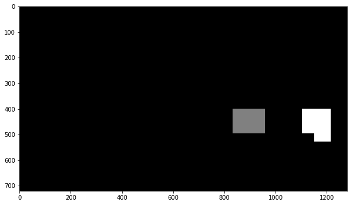
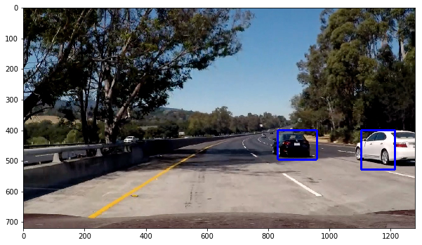
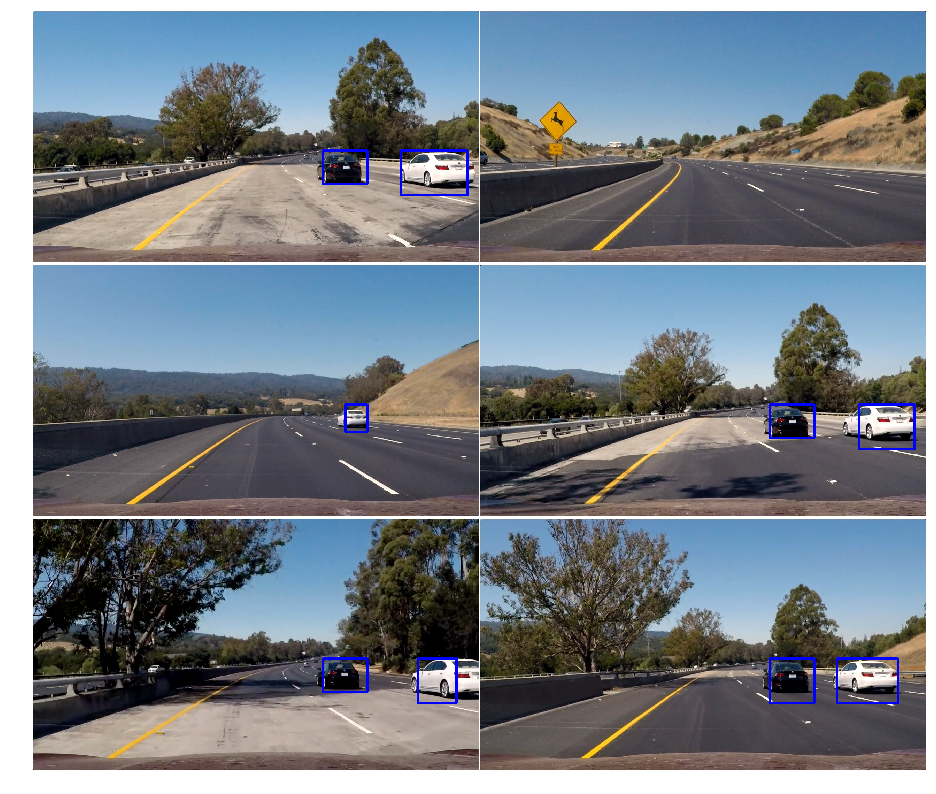

# Vehicle Detection and Tracking

### Steps taken to complete the project:
- Perform a Histogram of Oriented Gradients (HOG) feature extraction on a labeled training set of images and train a classifier Linear SVM classifier
- Optionally, you can also apply a color transform and append binned color features  as well as histograms of color, to your HOG feature vector.
- Note: for those first two steps don't forget to normalize your features and randomize a selection for training and testing.
- Implement a sliding-window technique and use your trained classifier to search for vehicles in images.
- Run your pipeline on a video stream (start with the test_video.mp4 and later implement on full project_video.mp4) and create a heat map of recurring detections frame by frame to reject outliers and follow detected vehicles.
- Estimate a bounding box for vehicles detected.


# 1. Histogram of Oriented Gradients (HOG)

## Take a look at the dataset

Dataset has *Cars* and *Non-Car* images. There are 8792 number of Cars 8968 number os non-car images in the dataset (Sample of these images as follows). I have read the image paths to to a list (You can find the code under "Load Image data" section in the `vehicledetection.ipynb` file)


## Extract HOG features from an image

`get_hog_features(...)` method in the code extract HOG features from the image. Within this function the `hog(...)` method that is in `skimage.feature` get called with the following parameters,


- orientations = 9,
- pixels_per_cell = (8, 8),
- cells_per_block = (8, 8),
- transform_sqrt = False,
- visualise = True,
- feature_vector = True


# Final choice of HOG parameters.


I have experimented with many different permutations of the HOG parameters to get a sense of what would work. Linear SVM classifier has been trained and tested for accuracy with those combinations. RGB color space is not favorable in different lighting conditions, and I eliminate that that early.  HLS (S channel), YUV and  YCrCb color channels present good results.  HOG feature extraction time was not that different for these color spaces; therefore, I did not decide the color space based on time factor. I have finally settled on the YUV color space with 11 orientations, 16 pixels per cell, 2 blocks per cells.

# Training a linear SVM


I have trained a linear SVM classifier using the HOG features extracted. As the first step after extracting features, Data has been split into two different sets as the first step: training and testing data. The ratio of test and testing data is 80 to 20 percent. The `sklearn.model_selection.train_test_split(...)` Method used to shuffle and split the data. `sklearn.svm.LinearSVC` used to create the classifier object and trained on the training dataset. The test accuracy has been checked using `score` method in the classifier object. This method returns the mean accuracy on the given test data and labels. In this particular case, the accuracy recorded as 98%. This means the model can detect vehicles up to 98% accuracy in a given image. In order to calculate this accuracy, the `score` method takes the test dataset as input.


# Sliding Window Search

In the find_cars method, the window method has been implemented. I adopted this method from the lesson materials. After extracting the HOG features, the image segment into different overlapping zones with different sliding window sizes. This various size of windows detects vehicles at different distances. The method performs the classifier prediction on the HOG features for each window region and returns a list of rectangle objects corresponding to the windows that generated a positive ("car") prediction. The search also only done select region in the image. Since the cars do not appear top part of the image (mostly the sky), there is no need to spend time looking for cars in this region. This also reduces false positive results.

The configurations for search windows and the image zones are:

```
windows = [
    {"ystart" : 400,"ystop" : 464,"scale" : 1.0},
    {"ystart" : 416,"ystop" : 480,"scale" : 1.0},
    {"ystart" : 400,"ystop" : 496,"scale" : 1.5},
    {"ystart" : 432,"ystop" : 528,"scale" : 1.5},
    {"ystart" : 400,"ystop" : 528,"scale" : 2.0},
    {"ystart" : 432,"ystop" : 560,"scale" : 2.0},
    {"ystart" : 400,"ystop" : 596,"scale" : 3.5},
    {"ystart" : 464,"ystop" : 660,"scale" : 3.5}
]
```

The following image shows a sample of search zones and search windows of various sizes





The following images shows the above configuration of search has detected the other vehicles in the image









As you can see in the above images, the cars are positively identified. These detections are not only by one search window size, these vehicles are detected by different size of windows. And also there are some false positive detections in these images. Combined heatmap and threshold are used to differentiate the true positives from the false positives.

Heat map before applying threshold.



After applying the threshold.




The scipy.ndimage.measurements.label() function collects spatially contiguous areas of the heatmap and assigns each a label:




The final results drown in original image.




# Examples of test images.



I have tested the final pipeline with different of the classifier. optimization techniques included changes to window sizing and overlap as described. Heatmap threshold is another parameter I have adjust to fine tune the detections and remove false positives.

# Video Implementation

Test video
https://youtu.be/rXqu94XdVQc


Final Video
https://youtu.be/2hJcBeyZlvY


The video processing pipeline is almost identical to the code for processing a single image described above. I have seen some frames are missing detections in the processed video outputs. In order to mitigate this issue, another new method has been introduced Vehicle_Detect. This method store the detections from the previous  15 frames of video using the `prev_rects` parameter from a class called `Vehicle_Detect`. When detecting the heatmap, the past 15 frames were considered. By testing many configurations I found the threshold value `1 + len(det.prev_rects)//2` works well.


# Issues I have experience during this project

Detection accuracy of the issues I have experienced during this project. Initially, the classifier detects too many false positive where I had to spend time testing many combinations of the parameters. This process (knowledge from the previous project) allow me to experiment with previous frame detections which substantially improve the results. Another issue I have seen in the final video is the distance vehicles. Distance vehicles are not detecting properly. I believe adding more training data by augmenting car images may improve detections. Using a convolutional neural network may well suit for this project and worth to explore in the future.
